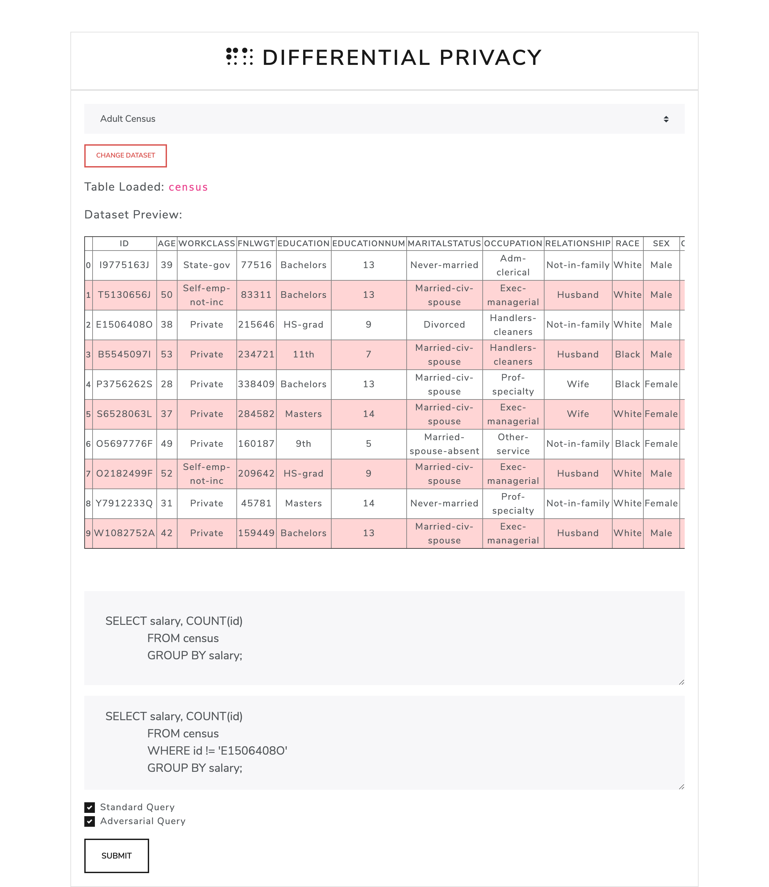

# Differential Privacy in Machine Learning
> This was a research project under NTU’s URECA (Undergraduate Research Experience on Campus) programme. I was presented URECA Undergraduate Research Excellence Award in recognition of outstanding research accomplishments with Distinction in URECA Undergraduate Research Programme AY2019-20.

Differential privacy makes it possible for tech companies to collect and share aggregate information about user habits, while maintaining the privacy of individual users.

In this project, we studied existing research developments in ε-differentially private algorithms on structured data using Google’s Differential Privacy Library and refine it so it can be used in real world production data.

This was a year long project, with a lot of unique experiences. In the beginning, we started with reading reseeach papers on Differential Privacy. In the development of the website shown above, I learnt how to operate Ubuntu Servers, use PostgreSQL and build websites with Flask.
